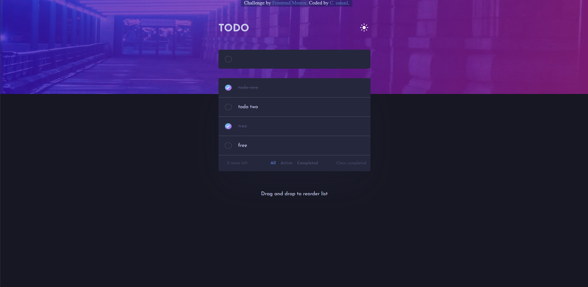

# Frontend Mentor - Todo app solution

This is a solution to the [Todo app challenge on Frontend Mentor](https://www.frontendmentor.io/challenges/todo-app-Su1_KokOW). Frontend Mentor challenges help you improve your coding skills by building realistic projects. 

## Table of contents

- [Overview](#overview)
  - [The challenge](#the-challenge)
  - [Screenshot](#screenshot)
  - [Links](#links)
- [My process](#my-process)
  - [Built with](#built-with)
  - [What I learned](#what-i-learned)
  - [Continued development](#continued-development)
- [Author](#author)


## Overview

### The challenge

Users should be able to:

- View the optimal layout for the app depending on their device's screen size
- See hover states for all interactive elements on the page
- Add new todos to the list
- Mark todos as complete
- Delete todos from the list
- Filter by all/active/complete todos
- Clear all completed todos
- Toggle light and dark mode
- **Bonus**: Drag and drop to reorder items on the list

### Screenshot




### Links

- Solution URL: [Add solution URL here](https://your-solution-url.com)
- Live Site URL: [Add live site URL here](https://your-live-site-url.com)

## My process

### Built with

- Semantic HTML5 markup
- CSS custom properties
- Flexbox
- CSS Grid
- [Vue.js](https://vuejs.org/)
- [Vite](https://vitejs.dev/) 
- [Vite PWA Plugin](https://vite-pwa-org.netlify.app/)

 

### What I learned

```css

.todo-item .checkbox {
    position: relative;
    cursor: pointer;
}

.todo-item .checkbox input {
    position: absolute;
    opacity: 0;
    cursor: pointer;
}

.todo-item .checkbox-icon {
    position: absolute;
    inset: 20px;
    border: none;
    border-radius: 100%;
    background-clip: padding-box;
    background: var(--todo-border);
}

.todo-item .checkbox-icon:hover {
    background: linear-gradient(to right bottom, hsl(192, 100%, 67%), hsl(280, 87%, 65%));
}

.todo-item .checkbox-icon:after {
    content: '';
    position: absolute;
    inset: 0;
    margin: 1px;
    border-radius: inherit;
    background: var(--todo-bg);
}

.todo-item .checkbox input:checked+.checkbox-icon:after {
    background: url('/icon-check.svg'), linear-gradient(to right bottom, hsl(192, 100%, 67%), hsl(280, 87%, 65%));
    background-repeat: no-repeat;
    background-position: center;
}
```
```js
handleDeleteTodo(todo: TodoItemType) {
  const findIndex = this.todoList.findIndex(a => a.id === todo.id)
  findIndex !== -1 && this.todoList.splice(findIndex, 1)
},
```


### Continued development

This Todo App project marks an exciting step in my coding journey, and I'm thrilled to share the progress I've made so far. Throughout the development process, I had the opportunity to delve into Progressive Web App (PWA) technologies for the first time. The experience has been enlightening, and I am convinced of the promising capabilities that PWAs offer.


## Author

- Frontend Mentor - [@yourusername](https://www.frontendmentor.io/profile/5nai3r)


